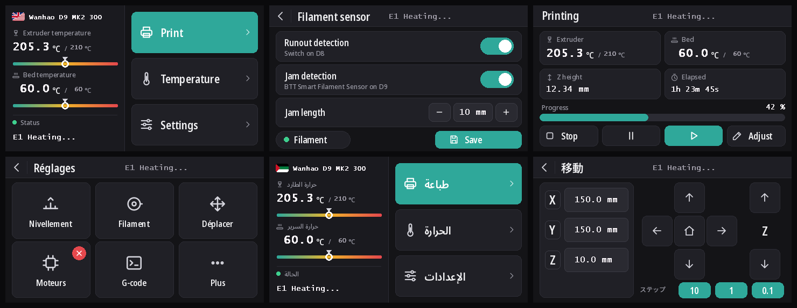
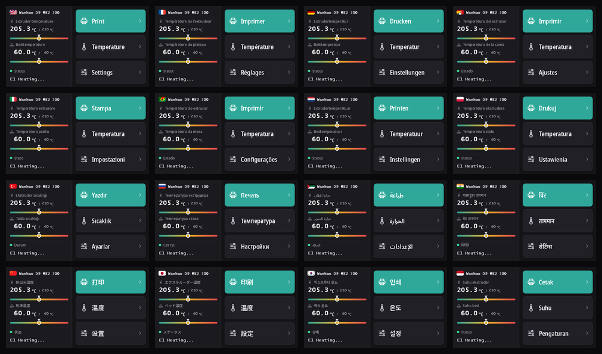

# DGUS Reloaded 2.0

 [English](#english) |  [Français](#français)

A new touchscreen interface for Marlin printers with a 480 × 272 DWIN T5UID1 screen (`DGUS_LCD_UI RELOADED`), in 16 languages.
Une nouvelle interface pour les imprimantes Marlin équipées d'un écran DWIN T5UID1 480 × 272 (`DGUS_LCD_UI RELOADED`), en 16 langues.



<a name="english"></a>
##  English

### What's new

DGUS Reloaded 2.0 redraws every page of [DGUS Reloaded](https://github.com/Desuuuu/DGUS-reloaded) and adds what the 1.0 series was missing on a daily basis.

- **A new look**: dark theme, teal accent, larger touch targets, clean Noto Sans labels, pictograms on the popups.
- **16 languages**: English, Français, Deutsch, Español, Italiano, Português, Nederlands, Polski, Türkçe, Русский, العربية, हिन्दी, 中文, 日本語, 한국어, Bahasa Indonesia. Tap the flag next to the printer name on the home screen to switch. The choice is saved in the printer's EEPROM.
- **Filament sensor page** (*Settings* → *Filament* → *Filament sensor*): turn runout detection on or off, turn jam detection on or off, set the jam length with − / + or the keypad. A dot shows whether filament is loaded. Changes apply at once and are only saved with *Save*: the back arrow leaves the stored settings alone.
- **A status line that stays**: one line, larger, and the last message (*Ready* for example) remains shown instead of disappearing after 30 seconds. The printer name has its own place at the top of the home screen.
- **Temperature gauges** on the home screen, from 0 to the maximum temperature, with the target marked.
- **Units drawn by the screen** (mm, %), so they follow the number instead of sitting at a fixed place.



### Requirements

- A 480 × 272 DWIN T5UID1 touchscreen. Tested on a Wanhao Duplicator 9 (DMT48270T043_07W). The screens DGUS Reloaded was made for (Creality CR-10S Pro, CR-10S Pro V2, Ender 5 Plus) have the same controller and resolution, but have not been tested with 2.0.
- Marlin `bugfix-2.1.x` built with `DGUS_LCD_UI RELOADED` **and** [`marlin/dgus-reloaded-2.patch`](marlin/dgus-reloaded-2.patch), until it is merged upstream ([MarlinFirmware/Marlin#28590](https://github.com/MarlinFirmware/Marlin/pull/28590)). The patch saves the language, drives the filament sensor page and keeps the status line. Without it the pages work, but the language goes back to English at each start and the filament sensor page does not work.
- Jam detection on/off relies on `M412 L0` from [MarlinFirmware/Marlin#28585](https://github.com/MarlinFirmware/Marlin/pull/28585).

Wanhao D9 owners: ready-made firmwares with both changes are in [WANHAO-Duplicator-9](https://github.com/Le-Syl21/WANHAO-Duplicator-9) (v2.0.9 and later).

### Flashing the screen

1. Download `DWIN_SET.zip` from the [latest release](https://github.com/Le-Syl21/DGUS-Reloaded-2/releases/latest).
2. Format a microSD card as FAT32 with an allocation unit of **4096 bytes**. With another size the screen ignores the card.
3. Unzip and copy the whole `DWIN_SET` folder to the root of the card.
4. Printer off, insert the card in the screen's slot, switch on. The screen shows the update within 10 to 30 seconds; wait until it restarts normally, 1 to 3 minutes in all.
5. Switch off, remove the card, switch on.

Going back: flash the DGUS Reloaded 1.0.3 `DWIN_SET` the same way.

### Building it yourself

The whole `DWIN_SET` is generated by Python: no DGUS Tool, no Windows.

```sh
python3 -m venv .venv && . .venv/bin/activate
pip install -r requirements.txt      # Pillow needs libraqm (Arabic and Hindi shaping)
tools/fetch_fonts.sh                 # Noto Sans, pinned and checked
python tools/build_screen.py         # build/DWIN_SET and build/preview/*.png
```

`build/preview` holds a picture of every page in every language, to check a change without flashing.

- `tools/strings.py`: all the translations, one line per label.
- `tools/build_screen.py`: the pages, popups and icons.
- `tools/screen_kit.py`: colours, fonts, glyphs, text icons.
- `tools/dwin_build.py`, `tools/dwin_dump.py`: encoders and decoders for the DWIN files.
- `base/DWIN_SET`: files reused from DGUS Reloaded 1.0.3 (touch and display records the pages start from, ASCII font, sounds, screen config, T5 system files).
- [`docs/dwin-formats.md`](docs/dwin-formats.md): the DWIN T5UID1 file formats, as far as we could decode and verify them.

### Translations

Corrections are welcome, especially from native speakers of Arabic, Hindi, Korean, Turkish and Indonesian. Edit `tools/strings.py` and open a pull request, or open an issue with the wrong label and the right one. A label that is too long is shrunk to fit, down to 70 %.

<a name="français"></a>
##  Français

### Nouveautés

DGUS Reloaded 2.0 redessine toutes les pages de [DGUS Reloaded](https://github.com/Desuuuu/DGUS-reloaded) et ajoute ce qui manquait au quotidien dans la série 1.0.

- **Un nouveau look** : thème sombre, accent bleu-vert, zones tactiles plus grandes, textes en Noto Sans, pictogrammes dans les fenêtres.
- **16 langues** : English, Français, Deutsch, Español, Italiano, Português, Nederlands, Polski, Türkçe, Русский, العربية, हिन्दी, 中文, 日本語, 한국어, Bahasa Indonesia. Touchez le drapeau à côté du nom de l'imprimante sur l'accueil pour changer. Le choix est enregistré dans l'EEPROM de l'imprimante.
- **Page capteur de filament** (*Réglages* → *Filament* → *Capteur de filament*) : activer ou désactiver la détection de fin de filament et celle de bourrage, régler la longueur de bourrage avec − / + ou le pavé numérique. Un point indique si le filament est présent. Les changements s'appliquent tout de suite et ne sont enregistrés qu'avec *Enregistrer* : la flèche de retour ne touche pas aux réglages enregistrés.
- **Une ligne d'état qui reste** : une seule ligne, plus grande, et le dernier message (*Ready* par exemple) reste affiché au lieu de disparaître au bout de 30 secondes. Le nom de l'imprimante a sa place en haut de l'accueil.
- **Jauges de température** sur l'accueil, de 0 à la température maximale, avec la consigne marquée.
- **Unités dessinées par l'écran** (mm, %) : elles suivent le nombre au lieu de rester à une place fixe.

### Prérequis

- Un écran tactile DWIN T5UID1 480 × 272. Testé sur une Wanhao Duplicator 9 (DMT48270T043_07W). Les écrans pour lesquels DGUS Reloaded a été fait (Creality CR-10S Pro, CR-10S Pro V2, Ender 5 Plus) ont le même contrôleur et la même résolution, mais n'ont pas été testés avec la 2.0.
- Marlin `bugfix-2.1.x` compilé avec `DGUS_LCD_UI RELOADED` **et** [`marlin/dgus-reloaded-2.patch`](marlin/dgus-reloaded-2.patch), en attendant son intégration dans Marlin ([MarlinFirmware/Marlin#28590](https://github.com/MarlinFirmware/Marlin/pull/28590)). Le patch enregistre la langue, pilote la page capteur de filament et garde la ligne d'état. Sans lui les pages fonctionnent, mais la langue revient à l'anglais à chaque démarrage et la page capteur de filament ne fonctionne pas.
- L'activation / désactivation du bourrage utilise `M412 L0` de [MarlinFirmware/Marlin#28585](https://github.com/MarlinFirmware/Marlin/pull/28585).

Propriétaires de Wanhao D9 : des firmwares prêts à flasher avec les deux changements sont dans [WANHAO-Duplicator-9](https://github.com/Le-Syl21/WANHAO-Duplicator-9) (v2.0.9 et suivantes).

### Flasher l'écran

1. Téléchargez `DWIN_SET.zip` depuis la [dernière version](https://github.com/Le-Syl21/DGUS-Reloaded-2/releases/latest).
2. Formatez une carte microSD en FAT32 avec une taille d'unité d'allocation de **4096 octets**. Avec une autre taille, l'écran ignore la carte.
3. Décompressez et copiez tout le dossier `DWIN_SET` à la racine de la carte.
4. Imprimante éteinte, insérez la carte dans la fente de l'écran, allumez. L'écran affiche la mise à jour en 10 à 30 secondes ; attendez qu'il redémarre normalement, 1 à 3 minutes en tout.
5. Éteignez, retirez la carte, rallumez.

Revenir en arrière : flashez de la même façon le `DWIN_SET` de DGUS Reloaded 1.0.3.

### Le générer soi-même

Tout le `DWIN_SET` est généré en Python : ni DGUS Tool, ni Windows.

```sh
python3 -m venv .venv && . .venv/bin/activate
pip install -r requirements.txt      # Pillow a besoin de libraqm (arabe et hindi)
tools/fetch_fonts.sh                 # Noto Sans, version fixée et vérifiée
python tools/build_screen.py         # build/DWIN_SET et build/preview/*.png
```

`build/preview` contient une image de chaque page dans chaque langue, pour vérifier une modification sans flasher.

### Traductions

Les corrections sont bienvenues, surtout de locuteurs natifs de l'arabe, du hindi, du coréen, du turc et de l'indonésien. Modifiez `tools/strings.py` et ouvrez une pull request, ou ouvrez un ticket avec le libellé faux et le bon. Un libellé trop long est réduit pour tenir, jusqu'à 70 %.

## Credits / Crédits

- [DGUS Reloaded](https://github.com/Desuuuu/DGUS-reloaded) by Desuuuu, and its [1.0.3](https://github.com/Neo2003/DGUS-reloaded) by Neo2003: the page structure, the Marlin side and the files in `base/`.
- [Noto Sans](https://fonts.google.com/noto) (SIL Open Font License 1.1), drawn into the pictures.
- `T5UID1_V30.BIN`, `T5OS_V21_NOACK.BIN`: DWIN's screen system files, as shipped with DGUS Reloaded 1.0.3.

## License / Licence

GPL-3.0, like DGUS Reloaded. See [LICENSE](LICENSE).
